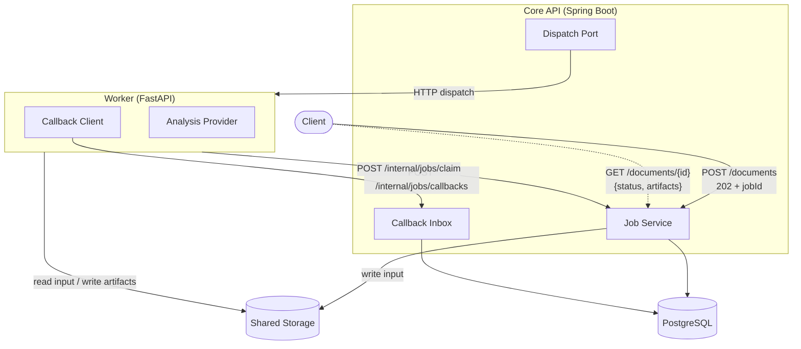
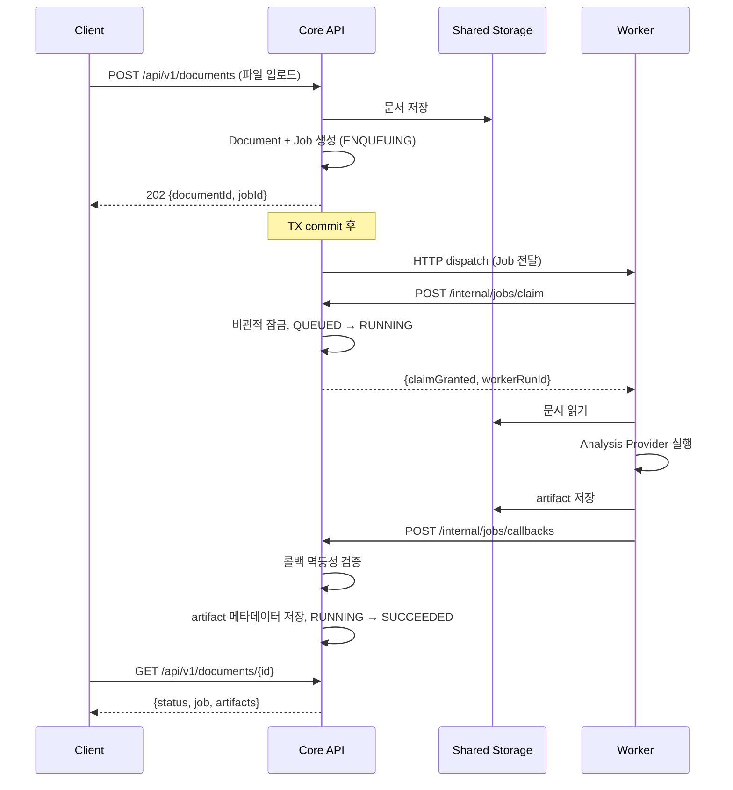
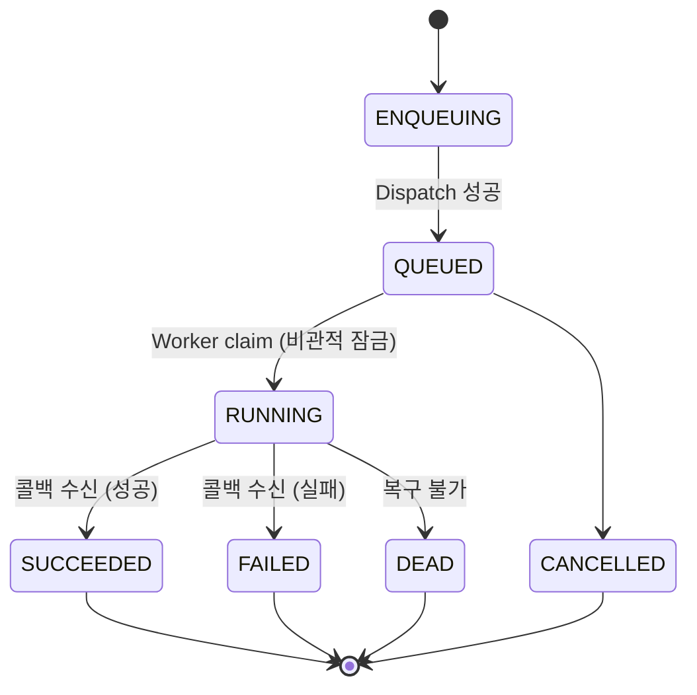

# Async Document Pipeline

Spring Boot + FastAPI 기반 비동기 문서 처리 아키텍처.
Job 수명주기 관리, 서비스 분리, Provider 추상화를 운영 수준의 패턴으로 구현한 프로젝트입니다.

두 개의 독립 서비스가 공유 DB와 HTTP 콜백으로 협업하여 문서를 비동기 처리합니다.

---

## 아키텍처



**Core API** (Java 21 / Spring Boot 4.0)는 데이터베이스를 소유하고 Job 상태를 관리합니다.
**Worker** (Python 3.12 / FastAPI)는 상태를 갖지 않는 실행 엔진으로, Job을 claim하고 처리한 뒤 결과를 콜백으로 보고합니다.

---

## 처리 흐름



### Job 상태 머신



| 전이 | 트리거 | 보호 조건 |
|------|--------|-----------|
| ENQUEUING → QUEUED | Dispatch 성공 | TX commit 이후 이벤트 리스너 |
| QUEUED → RUNNING | Worker claim 성공 | 비관적 잠금 + idempotencyKey 일치 |
| RUNNING → SUCCEEDED | 콜백 수신 (status=SUCCEEDED) | callbackId 유니크 제약 |
| RUNNING → FAILED | 콜백 수신 (status=FAILED) | 동일 |

---

## 프로젝트 구조

```
async-document-pipeline/
├── core-api/                  # Spring Boot — 오케스트레이션 & Public API
│   ├── api/                   #   REST 컨트롤러, 보안 설정
│   ├── job/                   #   Job 도메인, 포트, 서비스 (헥사고날 코어)
│   ├── infra-queue/           #   Dispatch 어댑터 (HTTP / Noop)
│   ├── infra-storage/         #   로컬 파일시스템 스토리지 어댑터
│   └── support/               #   공유 유틸리티
├── worker/                    # FastAPI — 상태 비보존 문서 처리기
│   └── app/
│       ├── api/               #   Task 엔드포인트, 스키마
│       ├── application/       #   AnalysisProvider 포트, 서비스
│       ├── infrastructure/    #   HTTP 클라이언트, 스토리지, Provider 구현체
│       └── runtime/           #   설정, 부트스트랩, 라이프사이클
├── contracts/                 # 서비스 간 JSON Schema 계약
├── db/                        # Flyway SQL 마이그레이션 (정본)
└── docs/                      # 아키텍처 문서 & ADR
```

### 모듈 역할

| 모듈 | 역할 |
|------|------|
| `core-api/job` | Job 상태 머신, 영속성 포트, claim/callback 로직 |
| `core-api/infra-queue` | Dispatch 어댑터 — `HttpJobDispatchAdapter` (Worker에 HTTP POST) 또는 `NoopJobDispatchAdapter` (개발용) |
| `core-api/infra-storage` | 로컬 파일시스템 스토리지. SHA-256 체크섬 포함 |
| `worker/application` | `AnalysisProvider` 프로토콜 + `AnalyzeService` 오케스트레이터 |
| `worker/infrastructure` | HTTP 클라이언트 (claim, callback), 스토리지, Provider 구현체 |

---

## 빠른 시작

### 사전 요구사항

- Docker, Docker Compose
- (선택) Java 21, Python 3.12 — Docker 없이 로컬 개발 시

### Docker Compose로 실행

```bash
# 클론 및 전체 서비스 시작
git clone <repo-url> && cd async-document-pipeline
docker compose up --build
```

시작되는 서비스:
- **PostgreSQL** — 포트 5432
- **Core API** — 포트 8082 (시작 시 Flyway 마이그레이션 실행)
- **Worker** — 포트 8000

### 파이프라인 테스트

```bash
# 1. 테스트 문서 생성
echo "The quick brown fox jumps over the lazy dog. This is a sample document for analysis." > sample.txt

# 2. 문서 제출
curl -s -X POST http://localhost:8082/api/v1/documents \
  -F "file=@sample.txt" | jq .

# 응답: { "documentId": "...", "jobId": "...", "status": "ENQUEUING" }

# 3. 상태 확인 (2단계에서 받은 documentId로 {id} 교체)
curl -s http://localhost:8082/api/v1/documents/{id} | jq .

# 응답: status, Job 상세, 완료 시 artifact 포함
```

### 서비스 개별 실행

**Core API:**
```bash
cd core-api
./gradlew :api:bootRun
# PostgreSQL이 localhost:5432에 실행 중이어야 함 (또는 SPRING_DATASOURCE_URL 설정)
```

**Worker:**
```bash
cd worker
pip install -e .
uvicorn main:app --reload --port 8000
```

---

## 설계 결정

### 왜 비동기 파이프라인인가?

문서 처리는 수 초에서 수 분까지 소요될 수 있습니다.
동기 방식(`POST → 대기 → 응답`)은 다음 문제를 야기합니다:

- HTTP 연결 점유로 인한 리소스 고갈
- 클라이언트 타임아웃 관리의 복잡성
- API 가용성이 Worker 가용성에 종속

비동기 패턴은 제출과 실행을 분리하여, 독립적인 스케일링과 장애 격리를 가능하게 합니다.

### 왜 Claim-Before-Execute인가?

At-least-once 전달 시스템(메시지 큐, 태스크 스케줄러)에서는 같은 Job이 여러 번 dispatch될 수 있습니다.
Claim 메커니즘이 이를 해결합니다:

- **Exactly-once 실행**: 하나의 Worker 인스턴스만 해당 Job을 처리
- **멱등 claim**: 같은 `idempotencyKey`는 항상 같은 `workerRunId`를 생성
- **상태 안전성**: Job 전이는 비관적 잠금으로 보호

### 왜 서비스 분리인가?

Core API (Java/Spring)와 Worker (Python/FastAPI)를 별도 서비스로 구성한 이유:

- **언어 적합성**: 오케스트레이션과 데이터 정합성 → JVM의 강점. 상태 비보존 연산 → Python의 강점
- **독립 스케일링**: Worker는 큐 깊이에 따라, API는 요청량에 따라 수평 확장
- **장애 격리**: Worker 장애가 API에 영향을 주지 않음. Job은 재시도 가능

### 왜 Provider 추상화인가?

`AnalysisProvider` 프로토콜로 처리 백엔드를 오케스트레이션 로직과 분리합니다:

- `MockProvider` — 테스트와 CI를 위한 결정적 fixture
- `LocalProvider` — 데모용 휴리스틱 텍스트 분석
- 향후: `ExternalProvider` — ML 서비스에 대한 HTTP 호출

환경변수 하나로 전환: `ANALYSIS_PROVIDER=mock|local`

### 왜 Callback Inbox인가?

`job_callback_inbox` 테이블이 멱등 콜백 처리를 보장합니다:

- 같은 `callbackId` + 같은 payload → 수락 (중복), 상태 변경 없음
- 같은 `callbackId` + 다른 payload → 거부 (409 Conflict)
- 네트워크 재시도를 Job 상태 손상 없이 처리

---

## 기술 스택

| 컴포넌트 | 기술 | 버전 |
|----------|------|------|
| Core API | Spring Boot | 4.0.3 |
| Worker | FastAPI | 0.115+ |
| Database | PostgreSQL | 16 |
| Build | Gradle (multi-module) | 8.12 |
| Migrations | Flyway | via Spring Boot |
| Containers | Docker Compose | v2 |
| Java | Eclipse Temurin | 21 |
| Python | CPython | 3.12 |

---

## 설정

모든 설정은 환경변수로 관리합니다. 전체 목록은 [`.env.example`](.env.example)을 참고하세요.

주요 변수:

| 변수 | 기본값 | 설명 |
|------|--------|------|
| `APP_QUEUE_DISPATCH_MODE` | `noop` | `http`: Worker에 dispatch, `noop`: 개발용 |
| `ANALYSIS_PROVIDER` | `local` | `mock`: fixture, `local`: 휴리스틱 분석 |
| `CORE_CLAIM_STUB_MODE` | `true` | `false`: 실제 Core API claim 엔드포인트 호출 |
| `CALLBACK_STUB_MODE` | `true` | `false`: 실제 콜백 발행 |

---

## 한계

포트폴리오 프로젝트로서 아키텍처 패턴에 집중하기 위해, 운영 수준의 일부 기능은 의도적으로 포함하지 않았습니다.

| 한계 | 운영 환경이라면 |
|------|-----------------|
| 단일 Worker, 분산 큐 없음 | Kafka / SQS / Cloud Tasks + 수평 스케일링 |
| FAILED Job 재시도 스케줄러 없음 | 스케줄러가 stale Job을 재dispatch |
| Artifact 다운로드 엔드포인트 없음 | Signed URL 또는 스트리밍 다운로드 API |
| External API 인증 없음 | JWT / OAuth2 미들웨어 |
| 실시간 상태 알림 없음 | WebSocket / SSE로 폴링 대체 |
| 클라우드 스토리지 미지원 | `ArtifactStoragePort` 구현체로 S3/GCS 어댑터 추가 |

이러한 확장은 아키텍처 변경 없이 포트/어댑터 교체만으로 가능하도록 설계되어 있습니다.

---

## 부록: 설계 과정 블로그

이 프로젝트의 아키텍처와 기술 선택 과정을 다룬 글입니다.

| 글 | 다루는 내용 |
|----|------------|
| [초기 아키텍쳐 설계](https://arin-nya.tistory.com/168) | Cloud Run + Cloud Tasks 선택 배경, Core Backend와 Worker 분리 원칙, GCS signed URL 기반 파일 흐름, MVP 단계에서 Kafka/Redis를 도입하지 않은 이유 |
| [MVP를 위한 백엔드 설계 및 구현](https://arin-nya.tistory.com/170) | Redis 미도입과 DB 중심 멱등성 관리, 멀티모듈 + 헥사고날 아키텍처 선택 근거, Cloud Run 분리를 고려한 모듈 경계, LLM 협업 환경에서의 아키텍처 테스트 활용 |

---

## License

MIT
