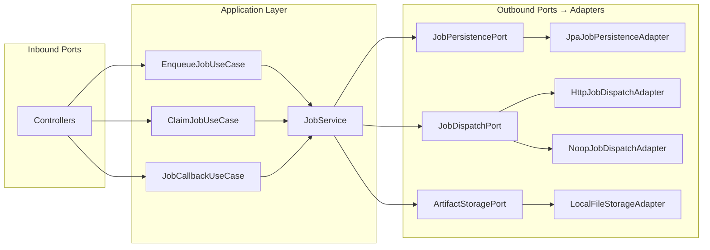
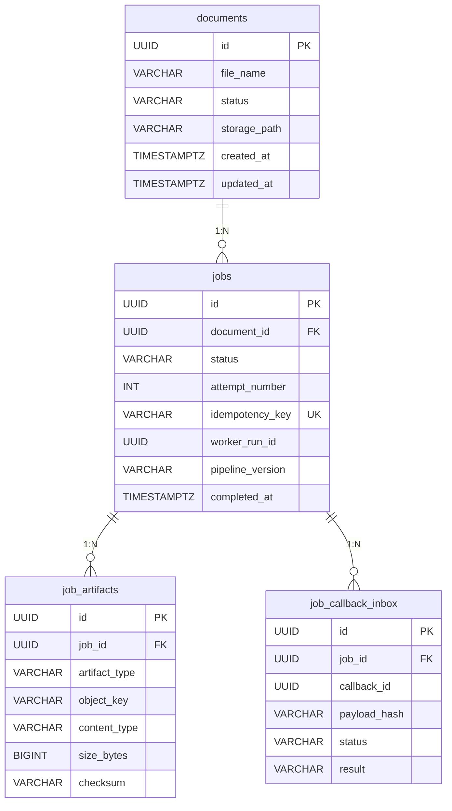
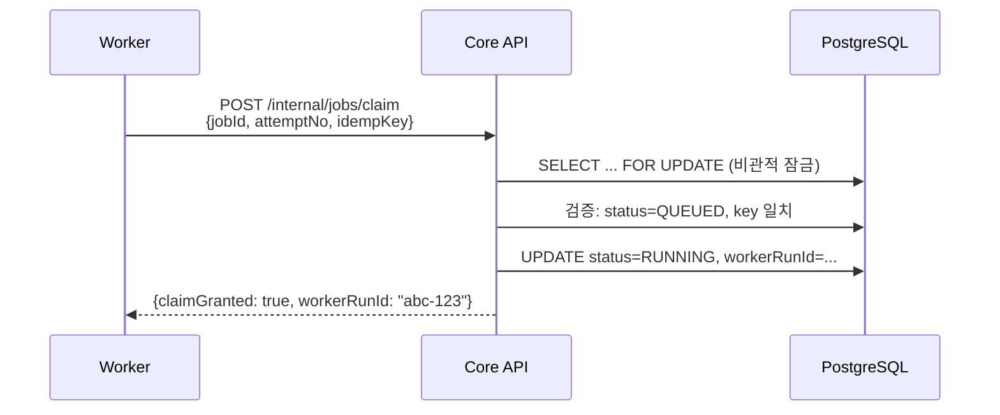
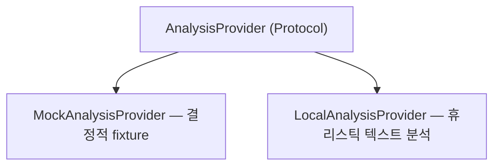

# 아키텍처 개요

## 시스템 컨텍스트

이 시스템은 두 개의 서비스로 구성된 비동기 문서 처리 아키텍처입니다:

- **Core API** (Spring Boot) — 데이터베이스를 소유하고, Job 수명주기를 관리하며, Public REST API를 제공하고, dispatch/callback 흐름을 조율합니다.
- **Worker** (FastAPI) — 상태를 갖지 않는 실행 엔진으로, Job을 claim하고, 분석을 수행하고, artifact를 업로드한 뒤, 콜백으로 결과를 보고합니다.

두 서비스는 artifact 저장을 위해 파일시스템 볼륨을 공유하고, Job dispatch, claim, callback을 위해 HTTP로 통신합니다.

## 헥사고날 아키텍처 (Ports & Adapters)

Core API는 도메인 로직을 인프라에서 분리하기 위해 헥사고날 아키텍처를 따릅니다:



**왜 헥사고날인가?** Job 오케스트레이션 로직(상태 전이, 멱등성, claim 검증)이 핵심이자 안정적인 코어입니다. 인프라 세부사항(어떤 DB, 어떤 큐, 어떤 스토리지)은 환경마다 달라집니다. 포트를 통해 이러한 관심사를 독립적으로 테스트하고 교체할 수 있습니다.

## 데이터 모델



## Dispatch 메커니즘

메시지 큐(Kafka, RabbitMQ, Cloud Tasks) 대신 **직접 HTTP dispatch**를 사용합니다:

1. `JobService.enqueue()`가 `@Transactional` 블록 안에서 Job을 저장
2. `@TransactionalEventListener(phase = AFTER_COMMIT)`가 트랜잭션 커밋 후 실행
3. 리스너가 `JobDispatchPort.dispatch()`를 호출하여 Worker에 HTTP POST

**왜 커밋 이후에 dispatch하는가?** 트랜잭션 내부에서 dispatch가 일어나고 트랜잭션이 롤백되면, Worker는 존재하지 않는 Job을 받게 됩니다. 커밋 이후에 dispatch하면 Worker가 Job을 받기 전에 영속화가 보장됩니다.

**트레이드오프**: 커밋 이후 dispatch HTTP 호출이 실패하면 Job이 `ENQUEUING` 상태에 남습니다. 운영 환경에서는 stale Job을 재dispatch하는 reconciliation 스케줄러를 추가해야 합니다. 이는 향후 개선 사항으로 기록합니다.

## Claim 프로토콜

Claim 메커니즘은 중복 실행을 방지합니다:



`workerRunId`는 결정적입니다: `UUID.nameUUIDFromBytes(jobId + attemptNo + idempotencyKey)`. 따라서 같은 파라미터로 재시도된 dispatch는 항상 같은 `workerRunId`를 받아, 상관관계 추적이 가능합니다.

## 콜백 멱등성

네트워크 재시도로 인해 같은 콜백이 여러 번 전달될 수 있습니다. `job_callback_inbox` 테이블이 이를 처리합니다:

| 시나리오 | HTTP 응답 | 동작 |
|----------|----------|------|
| 새 콜백, Job이 RUNNING | 200 | 적용: Job 전이, artifact 저장 |
| 중복 콜백 (같은 callbackId, 같은 payload hash) | 200 | 무시: 이미 처리됨 |
| 충돌 콜백 (같은 callbackId, 다른 payload) | 409 | 거부: 데이터 무결성 위반 |
| Job 없음 | 404 | 무시 |
| Job이 RUNNING 상태가 아님 | 202 | 수신했으나 미적용 |

## 스토리지 레이아웃

Artifact는 결정적 경로 구조로 저장됩니다:

```
{storage-root}/
├── documents/
│   └── {documentId}/
│       └── {fileName}              ← 업로드된 문서
└── jobs/
    └── {jobId}/
        └── attempts/
            └── {attemptNo}/
                └── artifacts/
                    └── {artifactType}/
                        ├── analysis.json       ← artifact 내용
                        └── analysis.json.meta  ← 사이드카 메타데이터
```

각 artifact에는 `contentType`, `sizeBytes`, SHA-256 `checksum`을 포함하는 `.meta` 사이드카 파일이 있어 무결성을 검증할 수 있습니다.

## Worker Provider 추상화



`AnalysisProvider` 프로토콜은 단일 메서드를 정의합니다: `analyze(content, file_name) → AnalysisResult`. 구현체는 `ANALYSIS_PROVIDER` 환경변수에 따라 시작 시점에 선택되며, Strategy 패턴을 따릅니다.

이 추상화가 존재하는 이유는 실제 시스템에서 분석 백엔드가 다양할 수 있기 때문입니다:
- 로컬 LLM (LLaMA, Gemma)
- 외부 API (OpenAI, Claude)
- 커스텀 ML 모델
- 규칙 기반 엔진

오케스트레이션 로직(claim, store, callback)은 어떤 Provider가 분석을 수행하든 동일하게 유지됩니다.
